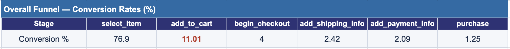
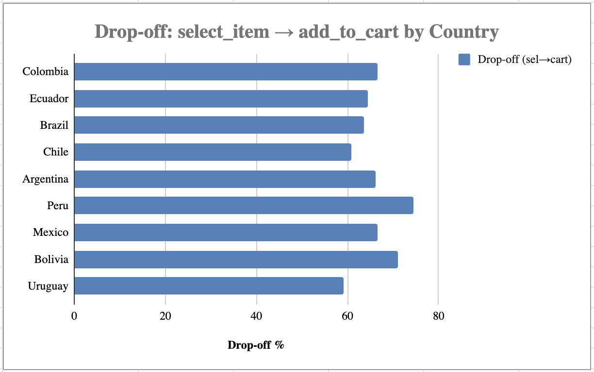
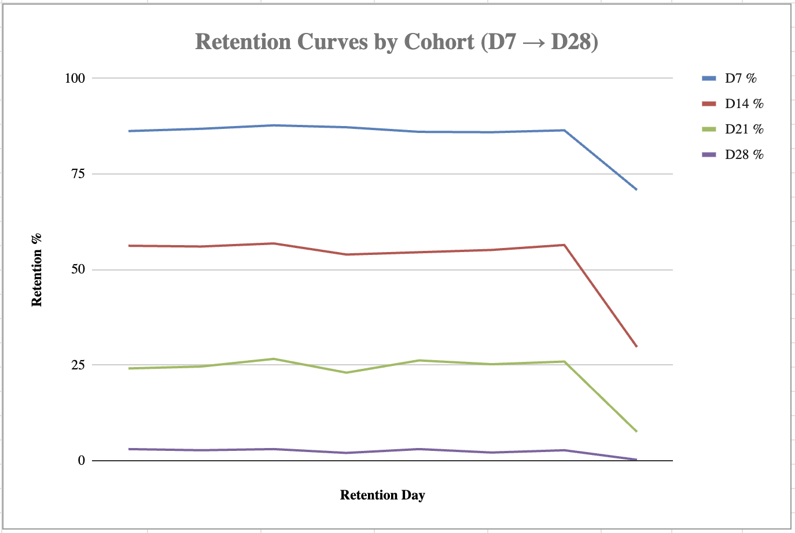
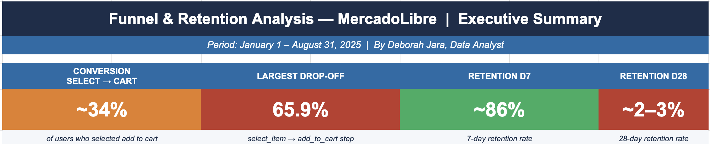

# Funnel & Retention Analysis with SQL — MercadoLibre

## The Business Problem

MercadoLibre's product director posed a challenge that every growth team eventually faces: *"We need to understand at which stage we lose users — and how we can improve their retention over time."*

Millions of users browse, click, and abandon. The question isn't whether drop-off happens — it's where, how much, and what to do about it.

I used SQL to find the answers.

## What I Did

Using two datasets covering January–August 2025, I mapped the complete conversion funnel from first visit to purchase, identified the largest drop-off points, and analysed user retention at D7, D14, D21, and D28 — both by country and by monthly cohort.

Every metric was built from scratch in SQL using CTEs, window functions, and conditional aggregation. Results were exported to Google Sheets for visualisation and executive reporting.

## What the Data Revealed

**Funnel:**
- The largest drop-off occurs at the **select_item → add_to_cart** step, with a ~65.9% loss — signalling critical friction at purchase intent, not at checkout
- Drop-off varies by country: Uruguay and Chile retain more users at this stage; Peru and Bolivia show the highest losses
- The problem is not transactional — it is rooted in trust, perceived value, and information clarity

**Retention:**
- Initial retention is strong: D7 ~86%, but falls sharply to ~2–3% by D28 — revealing a habit-formation gap
- Cohorts January–July show stable behaviour across all retention points
- The **August 2025 cohort is anomalous**: D7 dropped to 70.8% and D28 to just 0.2%, suggesting a deterioration in acquisition quality or onboarding experience that requires immediate investigation

*Overall conversion funnel — drop-off at each stage*

*select_item → add_to_cart drop-off segmented by country*

*D7–D28 retention curves by monthly cohort — August anomaly visible*

*Executive summary dashboard built in Google Sheets*

## Technical Details

### Dataset

| Table | Description |
|---|---|
| `mercadolibre_funnel` | User events during the purchase process (first_visit, select_item, add_to_cart, begin_checkout, add_shipping_info, add_payment_info, purchase) |
| `mercadolibre_retention` | Recurring activity by user and period (signup date, activity date, active flag, days after signup) |

Period analysed: January 1 – August 31, 2025

### Analytical Workflow

| Step | Description |
|---|---|
| 1. Data exploration | Reviewed available events and table structure |
| 2. General funnel | Multi-stage funnel using CTEs and LEFT JOINs; conversion rate at each stage relative to first visits |
| 3. Funnel by country | Segmented all funnel stages by country to identify geographic drop-off patterns |
| 4. Retention by country | Calculated D7, D14, D21, D28 retention counts and percentages per country |
| 5. Cohort retention | Assigned each user to a monthly cohort based on signup date and tracked retention over time |

### Key SQL Techniques

- Multi-stage CTE funnels with LEFT JOIN chaining
- `NULLIF` to avoid division by zero in conversion calculations
- Conditional aggregation with `CASE WHEN` for retention metrics
- `DATE_TRUNC` and `TO_CHAR` for cohort month assignment
- `COUNT(DISTINCT ...)` for accurate user deduplication

### Tools
SQL (PostgreSQL) · Google Sheets

### Files

- `analysis.sql` — all SQL queries organised by analysis section
- `MercadoLibre_Funnel_Retention_Executive_Report.xlsx` — executive summary with funnel and retention analysis

---

*By Deborah Jara | Data Analyst | México*
[LinkedIn](https://linkedin.com/in/deborahjara) · [GitHub](https://github.com/DebbieJara)
